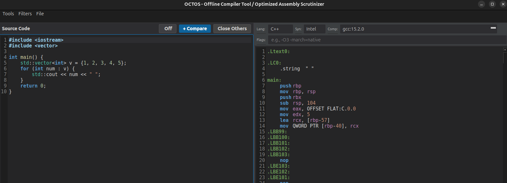
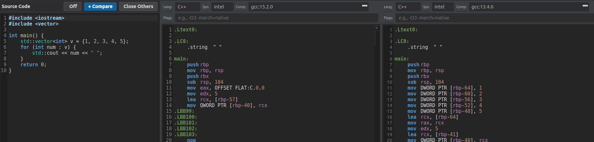

# OCTOS - Offline Compiler Tool Optimized Assembly Scrutinizer

<div align="center">
  

  **A multi-language assembly compiler and optimizer with Docker containerization**

  [](https://github.com/MichaelWeissDEV/OCTOS)
  [](#license)
  [](https://en.wikipedia.org/wiki/C%2B%2B)
  [](https://www.qt.io/)
  [](https://www.docker.com/)

</div>

---

## Project Statistics

- **Language**: C++ 17
- **Framework**: Qt 6
- **License**: MIT
- **Status**: Work In Progress

## What is OCTOS?

**OCTOS** is a desktop application for studying and optimizing compiled code. Write code in multiple programming languages, compile it to assembly, and examine the generated machine instructions with a beautiful, feature-rich UI.

It uses Docker for isolated compilation and provides a rich UI for visualization.

Originally developed as an internal pet project, OCTOS is now open source!



Multiple Compiler Versions can be used and compared side by side:




**IMPORTANT:** THIS IS AN INTERNAL PROJECT NOW OPEN SOURCE. IT IS STILL A WORK IN PROGRESS AND NOT PRODUCTION READY.
THIS WAS INSPIRED BY TOOLS LIKE GODbolt BUT AIMED AT OFFLINE USAGE. 
THER PROJECT IS AWSOME AND YOU SHOULD DEFINITELY CHECK IT OUT: https://godbolt.org/ OCTOS IS NOT A COMPETITOR TO GODBOLT JUST A TOY PROJECT FOR ME AND IF YOU IF YOU WANT. 
I HIGHLY RECOMMEND TO CHECK OUT GODBOLT AND MAYBE  LEAVE A STAR OR SUPORT THE PROJECT IF YOU LIKE IT. THIS IS JUST A PERSONAL PROJECT OF MINE BUT YOU ARE WELCOME TO USE IT AND CONTRIBUTE.

---

## Key Features

- **Multi-language compilation**: C/C++, Rust, Java, Python, Ada, C#
- **Docker-based isolated compilation**: Safe, reproducible builds
- **Real-time assembly visualization**: See generated code instantly
- **Advanced code filtering and annotation**: Customize your view
- **Syntax highlighting**: For multiple assembly variants
- **Compiler error display**: Clear error messages
- **Snippet management system**: Save and reuse code

---

## Requirements

### Hardware
- **CPU**: Modern multi-core processor (2+ cores recommended)
- **RAM**: 4GB minimum (8GB+ recommended for Docker)
- **Storage**: 20GB+ for Docker images and project files 

### Software
- **Docker**: >= 20.10 (for containerized compilation)
- **Qt Runtime**: >= 6.0
- **C++ 17 compiler**
- **Operating System**: Linux (primary), macOS/Windows with WSL2

---

## Quick Start

### Installation

#### Prerequisites
```bash
# Install Docker
sudo apt-get install docker.io

# Ensure Docker daemon is running
sudo systemctl start docker
sudo usermod -aG docker $USER
```

#### Building from Source
```bash
# Clone the repository
git clone https://github.com/MichaelWeissDEV/OCTOS.git
cd OCTOS

# Create build directory
mkdir build && cd build

# Configure and build
cmake ..
make -j4

# Run OCTOS
./OCTOS
```

---

## Usage Guide

### Basic Workflow

1. **Select Language**: Choose your target programming language from the dropdown
2. **Write Code**: Use the built-in editor or load a snippet
3. **Compile**: Click "Compile" or press the keyboard shortcut
4. **View Assembly**: See the generated machine code in the output pane
5. **Analyze**: Use filters and tools to understand the code

### Docker Image Management

OCTOS automatically pulls and caches compiler Docker images for isolated compilation.

---

## Learn More

This project is perfect for:
- Computer Science students learning compilers
- Developers optimizing code
- Assembly language enthusiasts
- Performance engineers

---

## Contributing

I welcome contributions! Whether you want to:
- Add support for new programming languages
- Improve the UI/UX
- Optimize Docker compilation
- Fix bugs
- Improve documentation

See [CONTRIBUTING.md](CONTRIBUTING.md) for detailed guidelines. Don't worry about perfection - this is a personal project but every contribution is welcome!

---

## Quick Links

- [README](../README.md) - Full documentation
- [Installation Guide](../INSTALL.md) - Setup instructions
- [Contributing Guide](../CONTRIBUTING.md) - How to contribute
- [Issues](https://github.com/MichaelWeissDEV/OCTOS/issues) - Report bugs
- [Discussions](https://github.com/MichaelWeissDEV/OCTOS/discussions) - Ask questions

---

**Originally created as an internal project · Now open source on GitHub · Everyone is welcome!**
